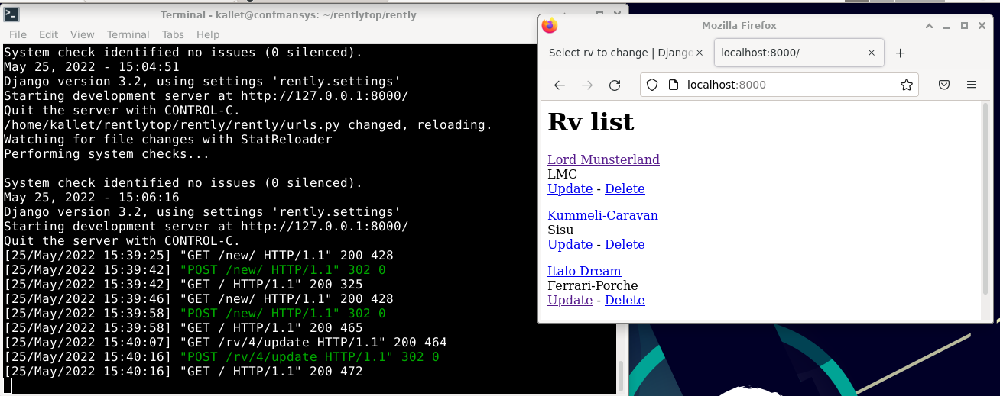

This is a simple CRUD example for Django. 3 tables and a foreign key.

Code from the lectures of:
https://www.terokarvinen.com

Source for foreign key:
https://riptutorial.com/django/example/30649/foreignkey

**Object listing with CRUD functionality**
